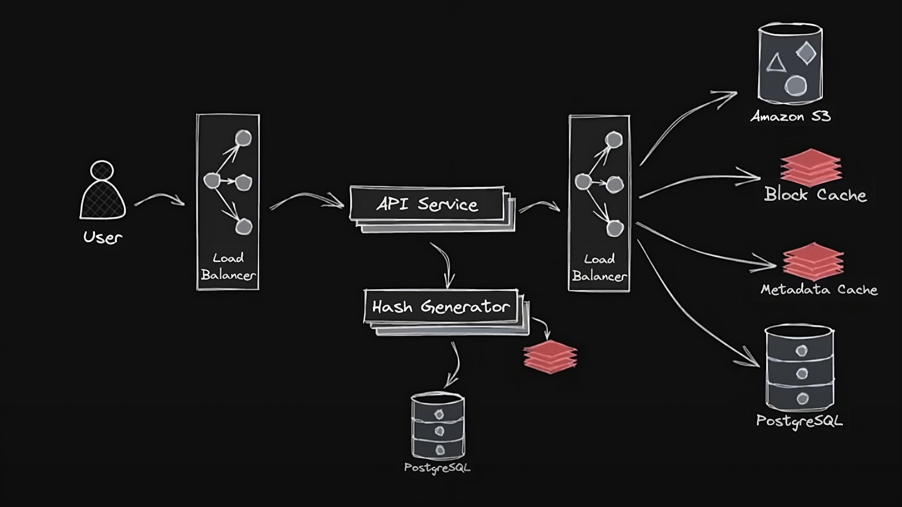

# Pastebin

Цель данного проекта — разработать серверную часть Pastebin, которая позволит пользователям делиться текстом друг с другом через URL.

Основные требования:

- Пользователь может создавать блок текста и загружать его в систему.
- Пользователь может отправлять ссылку на этот блок другому пользователю, который, перейдя по ней, увидит тот же блок текста.
- Блоки текста и ссылки деактивируются через какое-то время и удаляются из системы. Пользователь может сам указать, когда именно это происходит.

Секретные требования:

- Возвращаемые хэши в URL к постам должны быть уникальными и короткими.
- Некоторые посты будут гораздо популярнее других.
- Одни пользователи будут создавать посты чаще других.
- Добавить Swagger для тестирования функционала.

## Требования к архитектуре проекта

